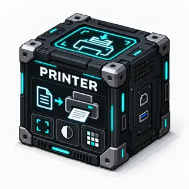

# Printer

An autonomous BloxSmith block that submits incoming documents to an **already
installed CUPS printer**. USB, Ethernet and Wi-Fi are handled by the printer's
existing OS queue, not by this block.

<!-- block-metadata:start -->
[](model.json)
[](compatibility.json)
[](LICENSE)

Verified BloxSmith versions: **1.0.9** (bundled-block tests; see [test evidence](compatibility.json)).
<!-- block-metadata:end -->

[](media/cover.png)

*Concept illustration. [Artwork and generation prompt](media/README.md).*

## Requirements

- Linux on the machine running BloxSmith, with `lp` and `lpstat` (CUPS client tools).
- A working printer queue and the required document filters/drivers, configured by
  the system administrator. The BloxSmith process must have permission to print.
- No extra Python dependency. The block never installs drivers, adds printers,
  changes default queues or stores printer passwords.

A remote browser does not give the server access to its own USB devices. Network
printers must already be configured on the **BloxSmith host**.

## Use

1. Open the modal or inspector. Click **Refresh** to list installed queues and select
   a printer, or leave **System default printer** selected.
2. Set copies, color, paper size, orientation, sides and optional page ranges.
3. Apply before Run. After changing settings on a loaded Run, Stop and Run again.
4. Connect a document source to `document`. Each execution submits **one real job**.

`Run` preparation alone does not print. Execution in Active Runtime and One Shot
has real hardware effects. Manual re-execution and repeated inputs are intentional
new jobs, even when the document contents are identical. There is no automatic retry.

### Ports

| Port | Type | Meaning |
| --- | --- | --- |
| `document` · input | `file/path`, `image/path`, `text/plain`, `application/json`, `application/pdf` | File path or text to print |
| `job` · output | `application/json` | CUPS submission receipt, emitted only after a job ID is received |

Accepted inputs:

- A file-path port, including the Scanner or Markdown PDF output.
- A JSON string `{"path":"documents/report.pdf"}` or `{"text":"Hello, printer!"}`.
- Plain text. A single line starting with an absolute/explicit relative path, or
  ending in a supported extension, is treated as a file path. Use JSON `text` to
  remove any ambiguity when printing a filename literally.

Paths refer to the server filesystem; relative paths start at the application
directory. `application/pdf` carries a **path**, not raw PDF bytes. URLs and binary
base64 payloads are deliberately not fetched/decoded.

Supported file extensions: PDF, TXT/TEXT/LOG/CSV/MD (plain text), PostScript, PNG,
JPEG, TIFF and PNM/PBM/PGM/PPM. Actual conversion support depends on the installed
CUPS filters. Markdown is printed as source text; DOCX/XLSX/HTML must be converted
to PDF first. Print options use standard CUPS/IPP options and must be supported by
the selected printer/driver; this block does not emulate duplex or color hardware.

Example receipt:

```json
{"job_id":"Office-42","printer":"Office","status":"submitted","copies":1}
```

**Submitted does not mean printed.** Paper jams, offline printers and completion
are managed by CUPS. Use the OS print queue to inspect or cancel an accepted job.

## Safety and limits

- Defaults: one copy, printer's own settings, 30-second submission timeout,
  50 MiB document limit. Maximum: 100 copies, 120 seconds and 200 MiB.
- Documents are snapshotted into a bounded temporary file, which is then removed.
- Commands use an argument array, never a shell. Device names and page ranges are
  validated. No document body is copied into the block log.
- Stop cancels an in-progress CLI, including on managed host death. A job already
  accepted by CUPS can still print. A timeout or missing job ID is **uncertain**:
  inspect the queue before retrying to avoid duplicate prints.
- The block is not a permission sandbox. Only connect trusted document sources;
  the application account's filesystem and printer permissions still apply.

## Tests and compatibility

Block-owned suites cover document inputs, configuration, no-shell arguments,
failures/cancellation, managed and linked package installation, centralized and
Active Runtime execution, downstream receipts, English/French properties and real
browser layouts at 1440, 390 and 320 pixels. Every hardware command is replaced by
a fixture. **No physical printer model is certified by these tests.**

From the private validation workspace:

```bash
python3 -B tests/run_tests.py --refresh-framework printer
```

Exact successful test evidence is recorded in `compatibility.json`. Model version
`0.1.0` is the initial local development version; no release is implied.

See the [official CUPS command-line options](https://openprinting.github.io/cups/doc/options.html).
Licensed under Apache-2.0; see [LICENSE](LICENSE).
